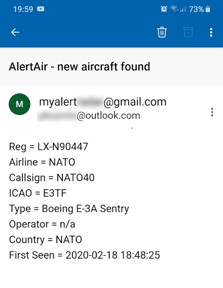

# AlertAir
The **AlertAir** is a small and simple Linux (Bash) utility for [Virtual Radar Server](http://www.virtualradarserver.co.uk/) to notify via email on new aircraft defined by user.

The general concept behind AlertAir is as follows:
* the AlertAir Bash script is exectued by crontab every five minutes
* the VRS BaseStation.sqb database is queried for user-defined aircraft being first-seen airborne within the last five minutes
* if there are any aircraft matching user-defined criteria found an email with aircraft data is sent to the user
* the result of every five-minute query is logged to the `alert-log.txt file`

## Prerequisites
* Virtual Radar Server up and running (Mono-based Linux version)
* Plugin DataBase Writer for Virtual Radar Server installed and set up
* BaseStation.sqb database created and being fed with current aircraft/flight data
* The utilities SWAKS (mail handling) and SQLITE3 (aircraft/flight database querying) installed

## Setup
* Download the ZIP file
* Head to the "utility/" subdirectory and extract files from it 
* Create a directory (e.g. within your home folder) und unzip the files into it
* Make the script file executable (`chmod u+x AlertAir.sh`)
* Open the alertair-config.txt file to define your own aircraft to alert. Simple how-to guidelines are found in it
* Open the AlertAir.sh file and head to the section "User-defined variables" to set your specific mail parameters etc. This is a one-off task
* Do not alter the section "Helper variables, not user-defined" in the AlertAir.sh file
* Open crontab with `sudo crontab -e` and put into it: `*/5 * * * * /<absolute_path_to_the_script>/AlertAir.sh` 
* Note: all AlertAir files (the script `AlertAir.sh`, the helper files `alertair-config.txt` and `alertair-log.txt`) are placed in the same directory 
* Note: the script creates some temporary files which are removed after script's execution

## Others
* AlertAir was tested on Debian 10
* AlertAir was tested with Virtual Radar Server version 2.4 but should run also with the lastest one as the VRS database remained unchanged
* Best results in terms of non-spam reporting were achieved if using a dedictated Gmail account for sending mails. Note that you have to generate an [application password for Gmail](https://support.google.com/accounts/answer/185833?hl=en) if using Google's two-factor authentication
* Please bear in mind that I am not a professional developer
* The AlertAir utility is provided under [MIT license](LICENSE)
* There is a great, easy to use Windows-based utility [PlaneAlerter](https://github.com/Dom2364/PlaneAlerter) by Dom2364 with many functionalities available
